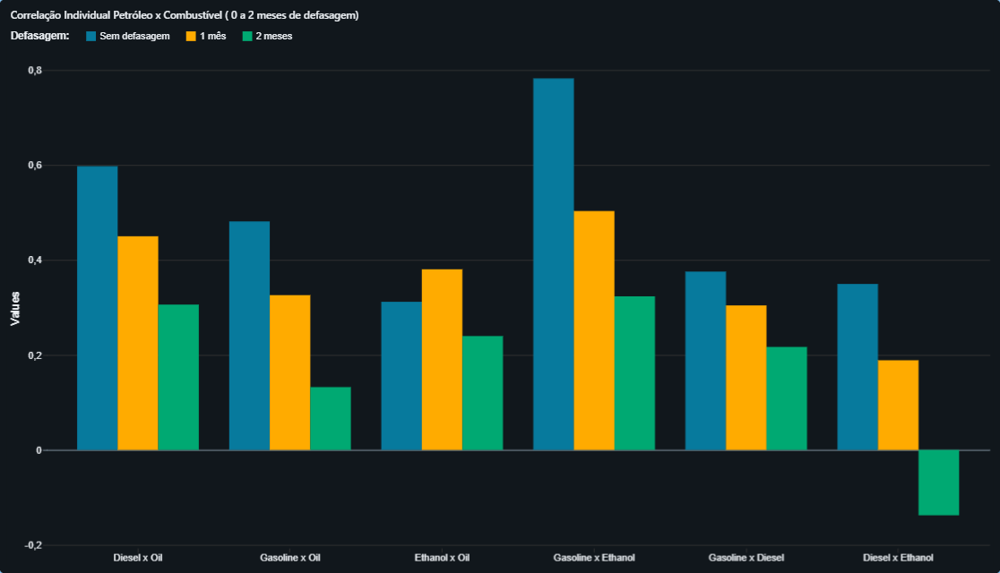
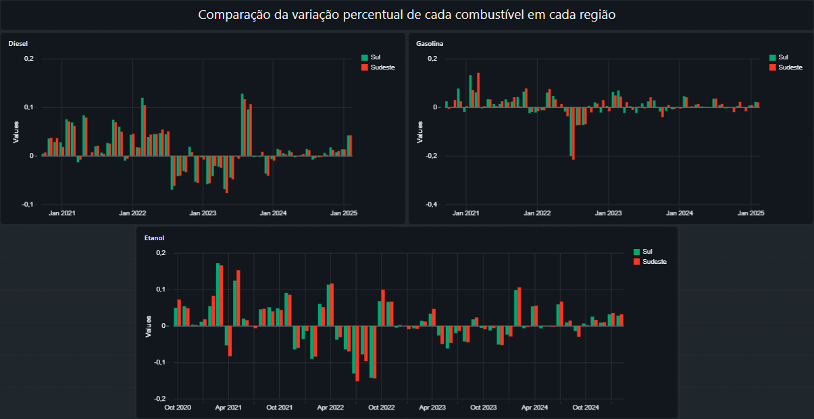

# MVP - Engenharia de Dados

Estudante: João Lucas Mota Nogueira da Costa

## Objetivos do MVP

O Objetivo principal deste MVP, é uma análise da evolução mensal do preço internacional do petróleo com os preços dos combustíveis no Brasil, avaliando padrões de variação, correlação e possíveis divergências entre esses mercados. Na medida do possível, caso identificada alguma divergência, averiguar eventos ocorridos na época para pontuar o motivo de tal discrepância.

## Perguntas a serem respondidas:

1. As variações do preço do petróleo e dos combustíveis (gasolina, diesel, etanol, etc.) acompanham-se mês a mês?

2. Em quais meses o comportamento divergiu?

3. Qual foi a maior e a menor variação percentual mensal do petróleo?

4. Qual foi a maior e a menor variação percentual mensal de cada combustível?

5. Qual período apresentou a maior diferença entre essas variações, comparando cada combustível com o petróleo?

6. Qual é a correlação entre:

    - Variação mensal do petróleo x gasolina?

    - Variação mensal do petróleo x diesel?

    - Variação mensal do petróleo x etanol?

7. Existe alguma diferença entre as correlações observadas para combustíveis de origem fóssil e origem vegetal?

8. O comportamento do petróleo se reflete imediatamente no preço do combustível? Há algum delay (defasagem)?

9. Há diferença significativa entre as variações de cada estado por região brasileira?

10. Há diferença significativa entre as variações de cada região do Brasil?

11. Foi possível identificar algum evento que possa ter afetado diretamente o preço do petróleo ou dos combustíveis? Se sim, quais eventos forma mais frequentes e qual evento causou a maior variação?

## Analises e Resultados

1. Analisando lado a lado os gráficos de preço médio mensal do petróleo e de cada um dos combustíveis, percebe-se que a variação dos combustíveis realmente acompanha o preço do petróleo, cada um tendo suas particularidades, como uma variação um pouco maior ou menor, mas é possível afirmar que os preços se acompanham sim.

2. Por mais que os produtos apresentem uma semelhança no comportamento de seus preços, podemos perceber um comportamento mais individual na variação percentual de cada um, apresentando picos e vales em momentos divergentes, o que leva a crer que há sim uma influência do petróleo, mas este não é o único fator que controla a variação. Levando em conta as métricas de diferença entre as variações percentuais do petróleo e de cada combustível, podemos perceber a maior diferença para cada produto nos seguintes meses:

Diesel: 
	- Pico: 12/2020 - O Diesel variou 12% a menos que o Petróleo.
	- Vale: 08/2023 - O Diesel variou 8% a mais que o Petróleo.

Gasolina:
	- Pico: 01/2022 - A Gasolina variou 14% a menos que o Petróleo.
	- Vale: 07/2022 - A Gasolina variou 9% a mais que o Petróleo.

Etanol:
	- Pico: 03/2022 - O Etanol variou 15% a menos que o Petróleo.
	- Vale: 03/2021 - O Etanol variou 12% a mais que o Petróleo.

3. Maior: +20% em 03/2022
   Menor: -11% em 07/2022 e 12/2022

4. Diesel:
	- Maior: +14% em 08/2023
	- Menor: -10% em 05/2023

   Gasolina:
	- Maior: +11% em 03/2021
	- Menor: -20% em 07/2022

   Etanol:
	- Maior: +18% em 03/2021
	- Menor: -16% em 09/2022

5. Resposta coberta pela análise realizada na pergunta 2.

6. Utilizando a técnica de correlação de Pearson (Resultados entre -1 e 1, onde -1 = Correlação negativa perfeita, 0 = Nenhuma correlação e 1 = Correlação positiva perfeita), chegamos aos valores aproximados:
Diesel:
	- Sem defasagem: 0,6
	- 1 mês: 0,45
	- 2 meses: 0,31

Gasolina:
	- Sem defasagem: 0,48
	- 1 mês: 0,33
	- 2 meses: 0,13

Etanol:
	- Sem defasagem: 0,31
	- 1 mês: 0,38
	- 2 meses: 0,24

Observações:
Os valores obtidos indicam que quanto maior a defasagem observada, menor a correlação, logo, a correlação existente é maior quanto menor o intervalo entre os valores analisados.

Levando em consideração que as correlações foram calculadas com base em dados com granularidade mensal, estas podem vir a aumentar, caso seja realizada uma análise de menor granularidade (Diária ou semanal). O que logicamente faz sentido considerando que eventos que afetem o preço do petróleo e dos combustíveis tendem a se tornar menos relevantes quanto mais o tempo passa, então o preço médio mensal pode ser uma métrica grosseira demais para esta análise.

Nenhum dos valores de correlação é negativo, o que faz sentido, já que é muito improvável que o preço do petróleo suba e dos combustíveis caia ou vice e versa.

A maior correlação observada é entre diesel e petróleo, com a menor sendo com o etanol, o que faz sentido considerando que petróleo não é a matéria-prima do etanol.

7. Como mencionado na resposta da pergunta 6, a correlação com etanol foi a menor entre as calculadas, o que faz sentido dada sua origem vegetal, porém, podemos perceber que os valores ainda são consideravelmente maiores do que 0, o que indica alguma correlação, mas não necessariamente direta. É comum que postos de combustível tenham reajustes aplicados a todos os combustíveis de uma vez, então é plausível considerar que a correlação entre combustíveis seja mais alta, já que estes devem ser afetados pelos mesmos fatores, incluindo o preço do petróleo, é possível observar isso já que cálculo da correlação entre a gasolina e o etanol resultou no maior valor observado, mas também deve-se levar em conta que a correlação entre diesel e etanol resultou em um valor negativo (mesmo sendo com defasagem de 2 meses), pode ser impacto da granularidade novamente, mas podemos concluir que é provável que estes produtos sofram influência de diferentes fatores.

8. Como já analisado previamente, defasando o cálculo de correlação em 1 ou 2 meses, o valor da correlação em quase todos os casos diminui conforme o intervalo aumenta. O que torna pouco provável que exista uma defasagem, pelo menos a nível mensal.

9. Por motivos de falta de dados na fonte utilizada no trabalho, o escopo analisado foi reduzido para apenas as regiões Sul e Sudeste.
Analisando os gráficos de variação percentual para cada combustível em cada estado da região Sul, podemos perceber que as variações tendem a acompanhar umas as outras, o que é esperado por serem estados de um mesmo país, muitas vezes influenciados pelos mesmos fatores, porém, é possível notar anomalias nos gráficos, métricas de alguns meses apontam um estado tendo uma variação muito maior que os outros e o estado em questão muda de um evento para o outro, mas para a região Sul tais ocasiões são mais comumente observadas para a gasolina, seguem alguns exemplos:

No período de 12/2022 até 03/2021, o estado de Santa Catarina apresentou uma variação consideravelmente diferente dos demais estados sulistas. Em dezembro, teve um aumento de 20% enquanto Paraná aumentou 2% e Rio Grande do Sul 1%, em janeiro teve uma queda de 12%, enquanto Paraná e Rio Grande do Sul tiveram aumentos de 3% e 4% respectivamente, em fevereiro o preço em Santa Catarina aumentou em 25% enquanto nos demais estados o aumento foi de apenas 8% e em março o estado Catarinense teve uma queda de 4% no preço, já os outros estados apresentaram aumentos de 12% e 11% seguindo a mesma ordem.
Isso pode indicar algum evento localizado especificamente no estado de Santa Catarina, já que os demais não aparentam ter sido afetados.
Santa Catarina foi utilizado como exemplo, mas graficamente podemos perceber eventos semelhantes com os demais estados e nos demais combustíveis.

Passando para a região Sudeste, podemos observar um cenário semelhante, onde a tendência dos preços é ao menos similar nos estados, mas a frequência de eventos que causam uma variação diferencial em um estado em específico é visualmente maior, novamente com a gasolina, é possível perceber diversos picos e vales na variação do preço do estado de Minas Gerais, desde 10/2020 até 10/2022, durante estes dois anos o estado se destaca tendo uma variação anormal no preço da gasolina. Mas nos dois anos seguintes, esta variação continua, mas no estado de São Paulo, entre 12/2022 e 12/2024, o estado notavelmente se destaca no gráfico diversas vezes, seja com crescimentos ou quedas no preço.

10. Novamente os dados aqui analisados se limitam às regiões Sul e Sudeste, mantendo o escopo da última questão.
Diferentemente da análise individual de cada estado, quando regiões inteiras são observadas simultaneamente, não é tão fácil de notar diferenças tão significativas quanto as mencionadas anteriormente, o que encaixa com a realidade, já que os estados, mesmo estando sob o governo nacional, ainda possuem um governo próprio, que pode agregar fatores únicos, enquanto regiões inteiras, são apenas separadas geograficamente e mesmo que seus estados apresentem anomalias, observando preços médios, os demais estados podem amortecer esta divergência, a tornando mais sutil e disfarçada.

11. Para manter o escopo estabelecido, os períodos pesquisados foram os que apresentaram divergências na questão 9.
Sobre a região Sul, mais especificamente sobre o estado de Santa Catarina, é possível encontrar relatos e notícias sobre desastres naturais neste período, mais especificamente enchentes e deslizamentos, eventos estes que foram noticiados globalmente (https://watchers.news/2022/12/21/severe-floods-and-landslides-hit-santa-catarina-brazil/?utm_source=chatgpt.com), considerando que eventos como estes podem facilmente afetar a distribuição de combustível é fácil relaciona-los as variações ocorridas, mas é válido considerar que os ocorridos sejam os únicos fatores responsáveis pelas drásticas mudanças observadas.

Sobre a região Sudeste, mais especificamente o estado de Minas Gerais, observa-se um comportamento atípico na variação do preço da gasolina entre outubro de 2020 e outubro de 2022, com picos e vales mais frequentes quando comparado aos demais estados da região. Durante este período, há registros de instabilidades logísticas e manifestações de transportadores em diferentes regiões do país, incluindo Minas Gerais, além de um contexto nacional marcado por elevada volatilidade nos preços dos combustíveis, fortemente influenciada pela recuperação econômica pós-pandemia e por sucessivos reajustes nos preços praticados pelas refinarias. Considerando que Minas Gerais possui grande extensão territorial e forte dependência do transporte rodoviário para abastecimento, é plausível que tais fatores tenham impactado de forma mais intensa a formação dos preços no estado. Ainda assim, não é possível afirmar que estes eventos sejam os únicos responsáveis pelas variações observadas, uma vez que fatores tributários, margens de distribuição e dinâmicas locais de mercado também podem ter contribuído para o comportamento identificado nos dados.
No caso do estado de São Paulo, no período compreendido entre dezembro de 2022 e dezembro de 2024, também é possível observar uma frequência elevada de variações diferenciadas no preço da gasolina em relação aos demais estados do Sudeste. Este intervalo coincide com mudanças relevantes no contexto nacional de precificação dos combustíveis, incluindo a revisão da política de preços adotada pelas refinarias a partir de 2023 e ajustes recorrentes nos valores praticados ao longo dos meses seguintes. Dada a elevada concentração de consumo, infraestrutura logística complexa e forte competição no mercado varejista paulista, variações na cadeia de suprimentos e nos preços de referência tendem a se refletir de forma mais visível no estado. Dessa forma, é razoável associar os picos e quedas observados a uma combinação de fatores nacionais e locais, embora não seja possível atribuir as variações registradas a um único evento específico ou isolado.

## Analise de Qualidade de Dados

Para este projeto foram utilizados dados de duas fontes diferentes, sendo elas o Yahoo! Finance, por meio da biblioteca yfinance em Python para os dados relacionados ao preço global do Petróleo, e a ANP (Agência Nacional do Petróleo), que divulga dados sobre preços de combustíveis em diversos postos em todos os estados do Brasil.
Em relação a qualidade, os dados sobre o petróleo estavam impecáveis, sendo coletados via biblioteca de Python, foi possível obter dados diários e completos sobre o produto, tendo disponibilidade de preços de abertura e fechamento, assim como preços máximos e mínimos de cada dia, todas estas informações desde o dia 30/07/2007 até os dias de hoje.
Já em relação aos preços dos combustíveis disponibilizados pela ANP, a tabela constava entradas de todos os postos dos quais coletava, sobre todos os combustíveis que coletava em todos os dias que coletava. Este modelo acabava gerando múltiplas linhas com valores vazios, já que medições poderiam não ser realizadas em certas datas, assim como, mais comumente, um posto não oferecer um certo tipo de combustível, desta forma, para uma análise mais concreta, foi necessária a transformação de produtos como “Gasolina comum”, “Gasolina aditivada” e “Gasolina premium” em apenas “Gasolina”, assim foi possível uma análise mais completa, já que atualmente, é muito improvável que um posto de combustíveis não ofereça gasolina, diesel e etanol, que foram os produtos abordados durante este projeto. Ainda sobre esta base de dados, o período é um pouco mais limitado, ofertando dados mensais desde 09/2020 até 09/2025, desta forma, foi necessário limitar a outra base de dados, para uma análise lado a lado.

## Autoavaliação

Acredito que consegui cumprir, pelo menos parcialmente, o objetivo estabelecido, já que houve a possibilidade de responder a todas as perguntas pré-estabelecidas, mesmo que sendo necessário diminuir o escopo de algumas delas para possibilitar uma análise mais precisa. 
Quanto a dificuldades encontradas durante a execução do projeto, ressalto principalmente a adaptação às novas ferramentas, já que pessoalmente nunca tive experiência com o Databricks, mas posso dizer com segurança que é uma ferramenta extremamente útil e completa, ótimas para todas as etapas, mesmo com as limitações de sua versão gratuita.
Para continuar com esse projeto, acho que seria interessante, trabalhar com granularidade semanal ou diária se possível, assim poderia possivelmente encontrar resultados diferentes dos apresentados. Também implementar uma análise de cada tipo de combustível, abordando variações dos observados, gasolina, etanol e diesel. Além disso, seria interessante buscar por alguma fonte diferente para os dados sobre combustíveis, já que a coleta de dados foi realizada manualmente, no caso de uma fonte que possua uma API ou outro sistema possível de automatizar, seria possível analisar a evolução destes dados, sem ter que manualmente trocar os dados coletados a cada vez que fossem atualizados.
